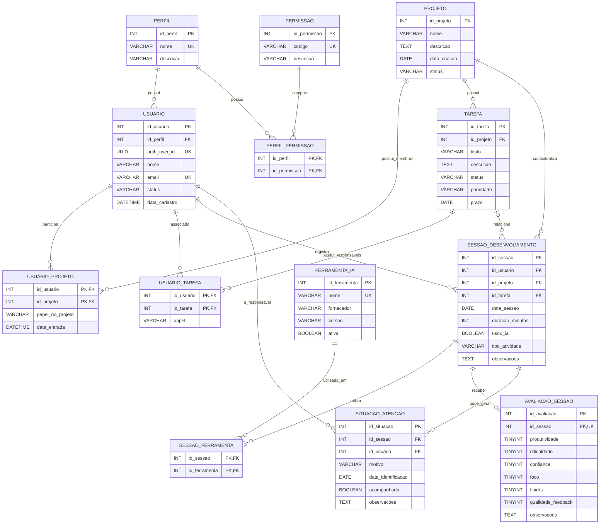

# DER — Rastreador de Uso de IA no Desenvolvimento

**Integrantes:** Artur Feiteiro Ruiz (2840482421032) — Tobias Gomide Fonsatti (2840482421046)

## 1. Diagrama

> Tipos acima (`INT`, `TINYINT`, `DATETIME`) refletem o desenho conceitual original. O
> script executável ([`db/schema.sql`](../db/schema.sql)) usa os tipos equivalentes em
> PostgreSQL (`SERIAL`/`INTEGER`, `SMALLINT`, `TIMESTAMP`) — ver nota no topo daquele
> arquivo.

## 2. Dicionário de dados

### Tabela: perfil

| Campo | Tipo | Restrições | Descrição |
|---|---|---|---|
| id_perfil | INT | PK, NOT NULL, AUTO_INCREMENT | Identificador único do perfil de acesso. |
| nome | VARCHAR(30) | UK, NOT NULL | Nome do perfil, como Desenvolvedor, Gestor ou Administrador. |
| descricao | VARCHAR(255) | NULL | Descrição das responsabilidades do perfil. |

### Tabela: permissao

| Campo | Tipo | Restrições | Descrição |
|---|---|---|---|
| id_permissao | INT | PK, NOT NULL, AUTO_INCREMENT | Identificador único da permissão. |
| codigo | VARCHAR(60) | UK, NOT NULL | Código único utilizado para verificar a autorização. |
| descricao | VARCHAR(255) | NOT NULL | Descrição da ação autorizada. |

### Tabela: perfil_permissao

Chave primária composta: (`id_perfil`, `id_permissao`).

| Campo | Tipo | Restrições | Descrição |
|---|---|---|---|
| id_perfil | INT | PK, FK, NOT NULL | Referência ao perfil que recebe a permissão. |
| id_permissao | INT | PK, FK, NOT NULL | Referência à permissão concedida ao perfil. |

### Tabela: usuario

| Campo | Tipo | Restrições | Descrição |
|---|---|---|---|
| id_usuario | INT | PK, NOT NULL, AUTO_INCREMENT | Identificador único do usuário. |
| id_perfil | INT | FK, NOT NULL | Perfil de acesso associado ao usuário. |
| auth_user_id | UUID | UK, NOT NULL | Referência ao usuário correspondente no Supabase Auth (`auth.users`) — autenticação e senha são geridas lá, não nesta tabela. |
| nome | VARCHAR(120) | NOT NULL | Nome completo do usuário. |
| email | VARCHAR(180) | UK, NOT NULL | E-mail usado para identificação e login. |
| status | VARCHAR(20) | NOT NULL, DEFAULT 'ATIVO' | Situação da conta: ATIVO, INATIVO ou BLOQUEADO. |
| data_cadastro | DATETIME | NOT NULL, DEFAULT CURRENT_TIMESTAMP | Data e hora de criação do cadastro. |

### Tabela: projeto

| Campo | Tipo | Restrições | Descrição |
|---|---|---|---|
| id_projeto | INT | PK, NOT NULL, AUTO_INCREMENT | Identificador único do projeto. |
| nome | VARCHAR(150) | NOT NULL | Nome do projeto. |
| descricao | TEXT | NULL | Detalhamento do projeto. |
| data_criacao | DATE | NOT NULL | Data de criação do projeto. |
| status | VARCHAR(20) | NOT NULL, DEFAULT 'ATIVO' | Situação do projeto: ATIVO, CONCLUIDO ou ARQUIVADO. |

### Tabela: usuario_projeto

Chave primária composta: (`id_usuario`, `id_projeto`).

| Campo | Tipo | Restrições | Descrição |
|---|---|---|---|
| id_usuario | INT | PK, FK, NOT NULL | Usuário participante do projeto. |
| id_projeto | INT | PK, FK, NOT NULL | Projeto do qual o usuário participa. |
| papel_no_projeto | VARCHAR(30) | NOT NULL | Papel do usuário no projeto, como membro ou gestor. |
| data_entrada | DATETIME | NOT NULL, DEFAULT CURRENT_TIMESTAMP | Data em que o usuário entrou no projeto. |

### Tabela: tarefa

| Campo | Tipo | Restrições | Descrição |
|---|---|---|---|
| id_tarefa | INT | PK, NOT NULL, AUTO_INCREMENT | Identificador único da tarefa. |
| id_projeto | INT | FK, NOT NULL | Projeto ao qual a tarefa pertence. |
| titulo | VARCHAR(180) | NOT NULL | Título resumido da tarefa. |
| descricao | TEXT | NULL | Descrição detalhada da tarefa. |
| status | VARCHAR(20) | NOT NULL, DEFAULT 'PENDENTE' | Situação: PENDENTE, EM_ANDAMENTO, CONCLUIDA ou CANCELADA. |
| prioridade | VARCHAR(20) | NOT NULL, DEFAULT 'MEDIA' | Prioridade: BAIXA, MEDIA ou ALTA. |
| prazo | DATE | NULL | Data limite para conclusão da tarefa. |

### Tabela: usuario_tarefa

Chave primária composta: (`id_usuario`, `id_tarefa`).

| Campo | Tipo | Restrições | Descrição |
|---|---|---|---|
| id_usuario | INT | PK, FK, NOT NULL | Usuário associado à tarefa. |
| id_tarefa | INT | PK, FK, NOT NULL | Tarefa associada ao usuário. |
| papel | VARCHAR(30) | NOT NULL | Papel do usuário na tarefa, como responsável ou colaborador. |

### Tabela: ferramenta_ia

| Campo | Tipo | Restrições | Descrição |
|---|---|---|---|
| id_ferramenta | INT | PK, NOT NULL, AUTO_INCREMENT | Identificador único da ferramenta de IA. |
| nome | VARCHAR(100) | UK, NOT NULL | Nome da ferramenta de IA. |
| fornecedor | VARCHAR(100) | NULL | Empresa ou organização fornecedora. |
| versao | VARCHAR(40) | NULL | Versão cadastrada da ferramenta. |
| ativa | BOOLEAN | NOT NULL, DEFAULT TRUE | Indica se a ferramenta está disponível para novos registros. |

### Tabela: sessao_desenvolvimento

| Campo | Tipo | Restrições | Descrição |
|---|---|---|---|
| id_sessao | INT | PK, NOT NULL, AUTO_INCREMENT | Identificador único da sessão de desenvolvimento. |
| id_usuario | INT | FK, NOT NULL | Usuário que registrou a sessão. |
| id_projeto | INT | FK, NOT NULL | Projeto relacionado à sessão. |
| id_tarefa | INT | FK, NULL | Tarefa relacionada, quando houver. Deve pertencer ao projeto informado. |
| data_sessao | DATE | NOT NULL | Data em que a sessão ocorreu. |
| duracao_minutos | INT | NOT NULL, CHECK (duracao_minutos > 0) | Duração da sessão em minutos. |
| usou_ia | BOOLEAN | NOT NULL, DEFAULT FALSE | Indica se houve uso de IA na sessão. |
| tipo_atividade | VARCHAR(60) | NOT NULL | Tipo de atividade realizada. |
| observacoes | TEXT | NULL | Observações gerais da sessão. |

### Tabela: sessao_ferramenta

Chave primária composta: (`id_sessao`, `id_ferramenta`). Essa tabela resolve o relacionamento N:N entre sessões e ferramentas de IA.

| Campo | Tipo | Restrições | Descrição |
|---|---|---|---|
| id_sessao | INT | PK, FK, NOT NULL | Sessão em que a ferramenta foi utilizada. |
| id_ferramenta | INT | PK, FK, NOT NULL | Ferramenta utilizada na sessão. |

### Tabela: avaliacao_sessao

| Campo | Tipo | Restrições | Descrição |
|---|---|---|---|
| id_avaliacao | INT | PK, NOT NULL, AUTO_INCREMENT | Identificador único da avaliação. |
| id_sessao | INT | FK, UK, NOT NULL | Sessão avaliada; a unicidade garante no máximo uma avaliação por sessão. |
| produtividade | TINYINT | NOT NULL, CHECK (1 <= produtividade <= 5) | Nota de produtividade da sessão. |
| dificuldade | TINYINT | NOT NULL, CHECK (1 <= dificuldade <= 5) | Grau de dificuldade percebido. |
| confianca | TINYINT | NOT NULL, CHECK (1 <= confianca <= 5) | Nível de confiança do usuário. |
| foco | TINYINT | NOT NULL, CHECK (1 <= foco <= 5) | Nível de foco durante a sessão. |
| fluidez | TINYINT | NOT NULL, CHECK (1 <= fluidez <= 5) | Fluidez percebida no desenvolvimento. |
| qualidade_feedback | TINYINT | NOT NULL, CHECK (1 <= qualidade_feedback <= 5) | Qualidade percebida dos resultados ou feedbacks da IA. |
| observacoes | TEXT | NULL | Comentários adicionais sobre a avaliação. |

### Tabela: situacao_atencao

| Campo | Tipo | Restrições | Descrição |
|---|---|---|---|
| id_situacao | INT | PK, NOT NULL, AUTO_INCREMENT | Identificador único da situação de atenção. |
| id_sessao | INT | FK, NOT NULL | Sessão que originou ou evidenciou a situação. |
| id_usuario | INT | FK, NOT NULL | Usuário ao qual a situação se refere. |
| motivo | VARCHAR(255) | NOT NULL | Motivo da identificação da situação. |
| data_identificacao | DATE | NOT NULL | Data em que a situação foi identificada. |
| acompanhada | BOOLEAN | NOT NULL, DEFAULT FALSE | Indica se o gestor já acompanhou a situação. |
| observacoes | TEXT | NULL | Registro de observações do acompanhamento. |

## 3. Regras de integridade e normalização

1. Todo registro possui uma chave primária simples ou, nas tabelas associativas, uma chave primária composta formada pelas chaves estrangeiras.
2. As chaves estrangeiras garantem a integridade referencial entre usuários, projetos, tarefas, sessões, avaliações e ferramentas.
3. Os relacionamentos N:N foram decompostos nas tabelas `usuario_projeto`, `usuario_tarefa`, `perfil_permissao` e `sessao_ferramenta`.
4. Os atributos são atômicos e não existem grupos repetitivos, atendendo à 1FN.
5. As tabelas com chave composta não possuem atributos dependentes de apenas parte da chave, atendendo à 2FN.
6. Dados de perfil, permissão e ferramenta de IA não são repetidos em cada usuário ou sessão; são referenciados por chaves estrangeiras, atendendo à 3FN.
7. Uma avaliação é opcional para cada sessão e, quando existir, só pode haver uma avaliação vinculada à mesma sessão.
8. Uma sessão pode não possuir tarefa relacionada, mas deve estar vinculada a um projeto e a um usuário.
9. Quando `usou_ia = FALSE`, a sessão não deve possuir registros correspondentes em `sessao_ferramenta`. Quando `usou_ia = TRUE`, deve haver pelo menos uma ferramenta associada após a validação do registro.
10. O dashboard deve ser produzido por consultas e filtros sobre os dados persistidos, sem armazenar indicadores derivados que poderiam ficar desatualizados.
