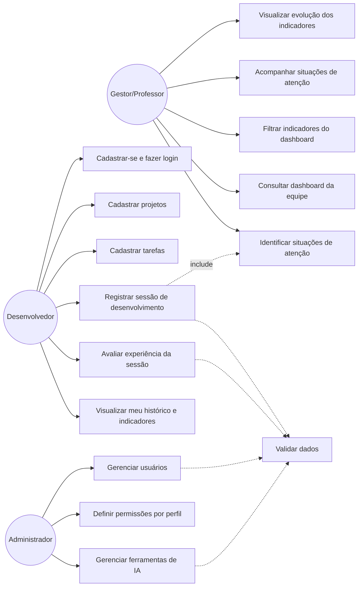
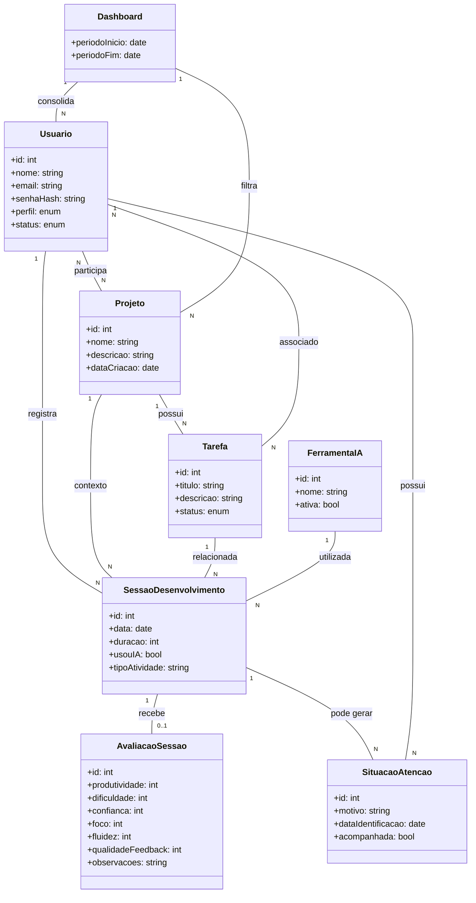

# Diagramas UML — Rastreador de Uso de IA no Desenvolvimento

**Equipe:** Artur Feiteiro Ruiz (2840482421032) — Tobias Gomide Fonsatti (2840482421046)

## 1. Diagrama de Casos de Uso

## 2. Diagrama de Classes

## 3. Rastreabilidade — caso de uso → história do backlog

| Caso de uso | História(s) relacionada(s) (E2) |
|---|---|
| Cadastrar-se e fazer login | #1 |
| Cadastrar projetos | #2 |
| Cadastrar tarefas | #3 |
| Gerenciar usuários | #4 |
| Definir permissões por perfil | #5 |
| Gerenciar ferramentas de IA | #6 |
| Registrar sessão de desenvolvimento | #7 |
| Avaliar experiência da sessão | #8, #9 |
| Identificar situações de atenção | #10 |
| Visualizar meu histórico e indicadores | #11 |
| Consultar dashboard da equipe | #12 |
| Filtrar indicadores do dashboard | #13 |
| Acompanhar situações de atenção | #14 |
| Visualizar evolução dos indicadores | #15 |
| Validar dados | #16 |
| Aplicação pública por URL | #17 |
| README completo no repositório | #18 |
